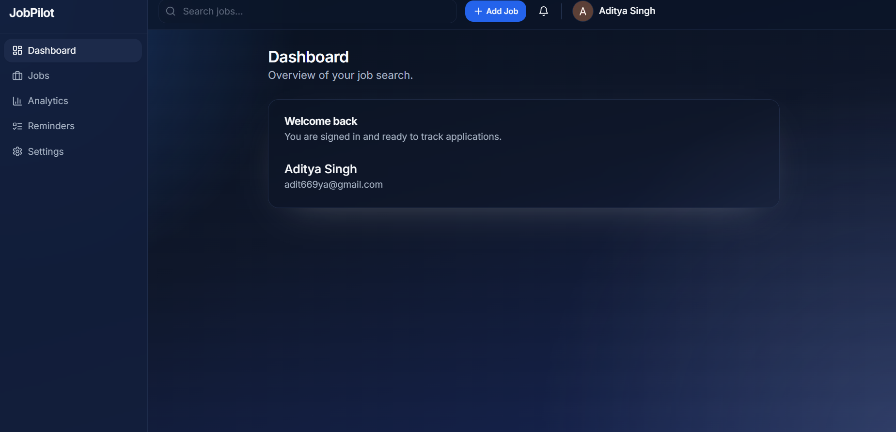
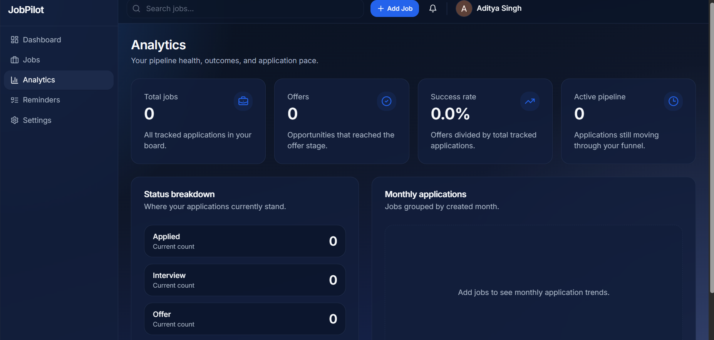
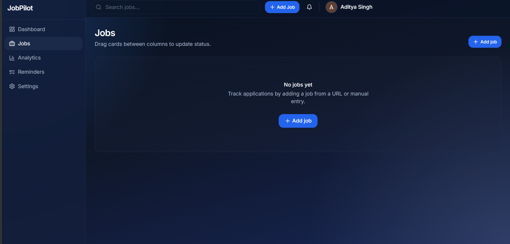
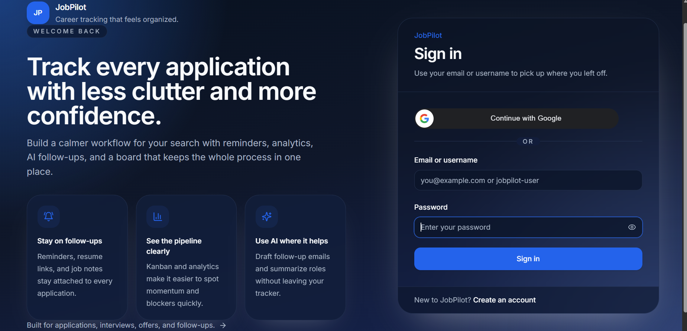
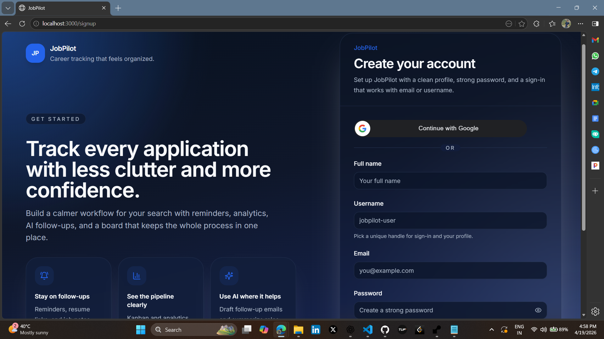

# JobPilot AI 🚀


A modern **full-stack AI-powered job application tracker** built for students, job seekers, and developers.
Track applications, organize progress with Kanban workflow, receive reminders, analytics, and manage your job hunt smarter.

---

## 🌐 Live Demo

* **Frontend:** [https://jobpilot-client-ch.vercel.app](https://jobpilot-client-ch.vercel.app)
* **Backend API:** [https://web-dev-journey-cnee.onrender.com](https://web-dev-journey-cnee.onrender.com)

---

## 📸 Screenshots








---

## ✨ Features

### 🔐 Authentication

* Email + Password Login / Signup
* Login using Email or Username
* Google OAuth Login
* JWT Protected Routes
* Session Persistence

### 💼 Job Management

* Add / Edit / Delete Jobs
* Company, Role, Salary, Notes, Link Storage
* Track Status: Applied / Interview / Offer / Rejected

### 📋 Kanban Workflow

* Drag & Drop Job Cards
* Realtime Status Updates

### 🤖 AI Features

* AI Follow-up Message Generator

### ⏰ Reminder System

* Automated Reminder Scheduler
* Email Follow-up Alerts

### 📊 Analytics

* Total Applications
* Offer / Reject Metrics
* Search Progress Insights

### 🎨 UI / UX

* Responsive Design
* Dark / Light / Gradient Themes
* Smooth Dashboard Experience

---

## 🧱 Tech Stack

### Frontend

* Next.js 14
* React.js
* Tailwind CSS
* Axios

### Backend

* Node.js
* Express.js
* MongoDB Atlas
* Mongoose
* JWT
* Nodemailer

---

## 📂 Folder Structure

```bash
JobPilot/
├── backend/
├── frontend/
├── docs/
├── screenshots/
└── README.md
```

---

## 🚀 Local Setup

```bash
git clone https://github.com/chauhandigvijay1/web-dev-journey.git
cd web-dev-journey/JobPilot
```

### Backend

```bash
cd backend
npm install
npm run dev
```

### Frontend

```bash
cd frontend
npm install
npm run dev
```

Open: [http://localhost:3000](http://localhost:3000)

---

## 🌍 Deployment

### Frontend (Vercel)

* Root Directory: `JobPilot/frontend`
* Add Environment Variables
* Deploy

### Backend (Render)

* Root Directory: `JobPilot/backend`
* Add Environment Variables
* Deploy

---

## 📈 Future Improvements

* AI Resume Analyzer
* Interview Questions Generator
* Cover Letter Generator
* Resume Parser AI
* Calendar Sync
* Browser Extension
* One-click Apply Tracker
* Team Collaboration Workspace
* Advanced Analytics Dashboard
* Email Follow-up Templates

---

## 👨‍💻 Author

**Digvijay Kumar Singh**

* GitHub: [chauhandigvijay1](https://github.com/chauhandigvijay1)
* LinkedIn: [digvijaykumarsingh](www.linkedin.com/in/digvijaykumarsingh)
* Portfolio: [dsc-portfolio](https://dsc-portfolio-website.netlify.app/)

---

## ⭐ Support

If you like this project, give it a **star ⭐ on GitHub**
