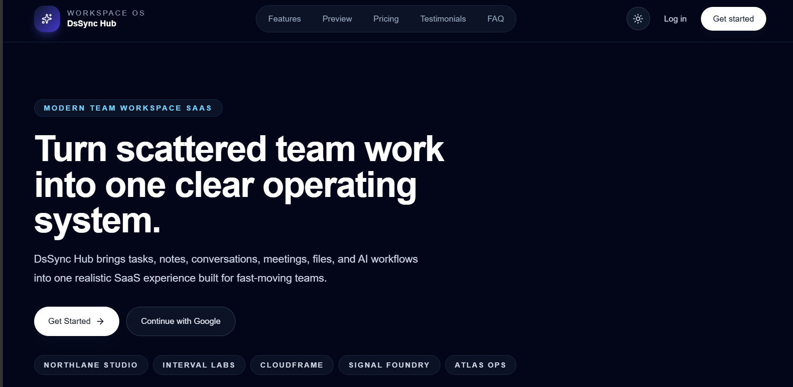
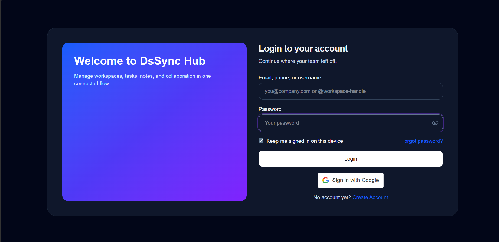
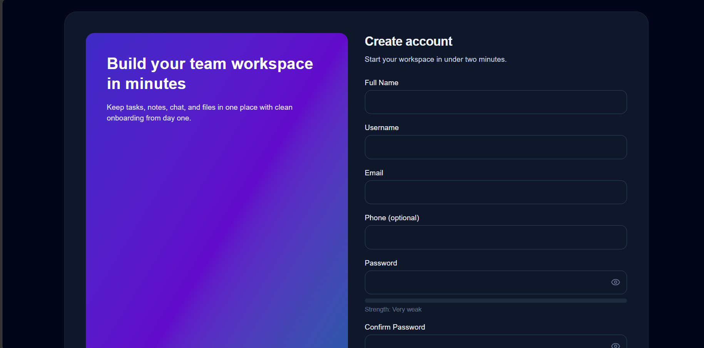
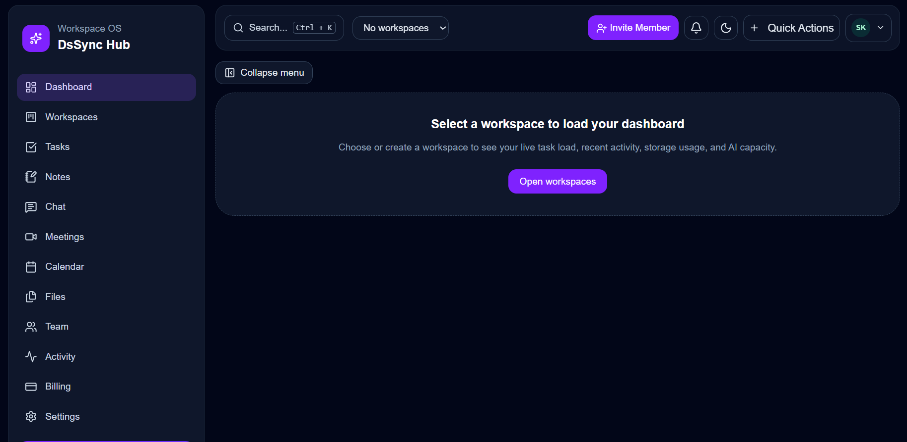
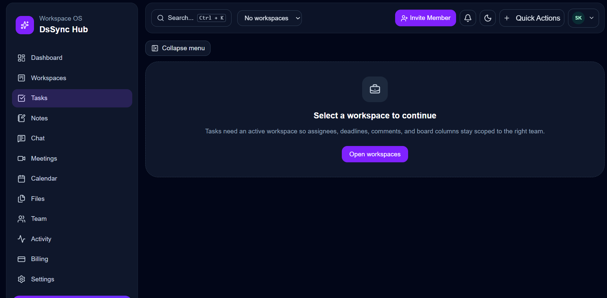
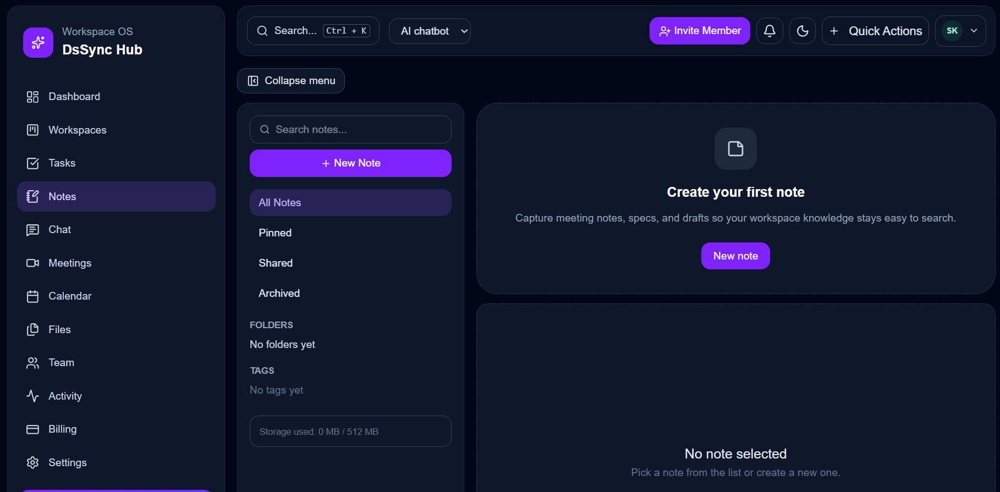
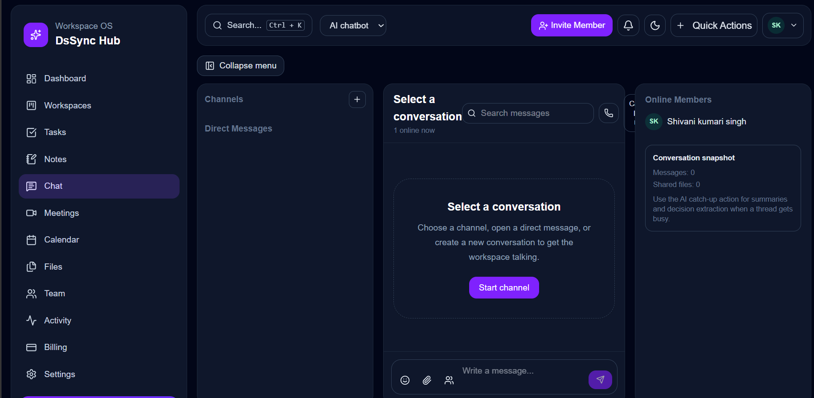
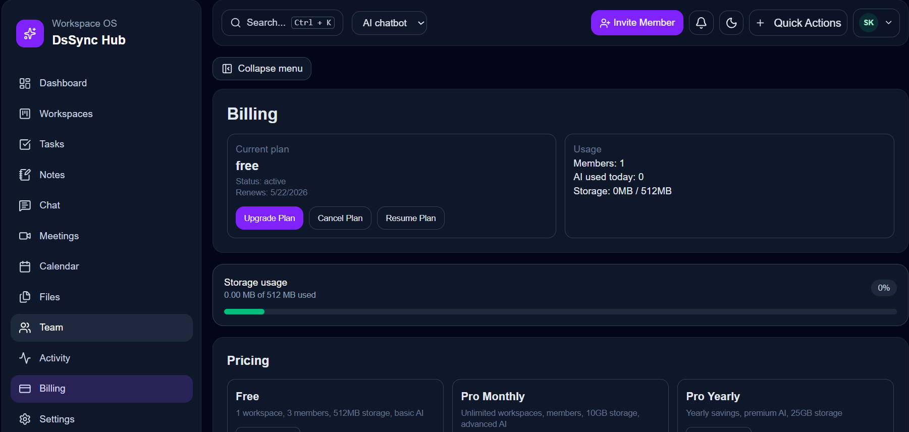
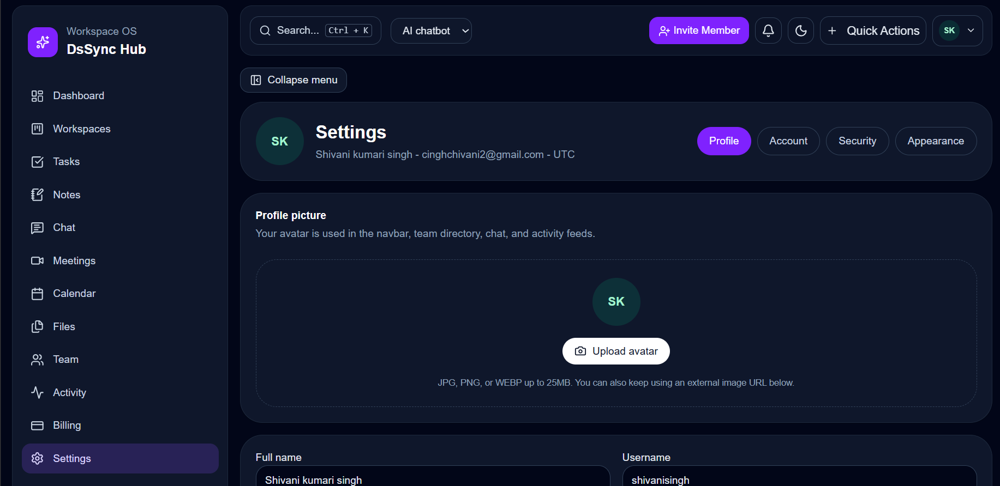
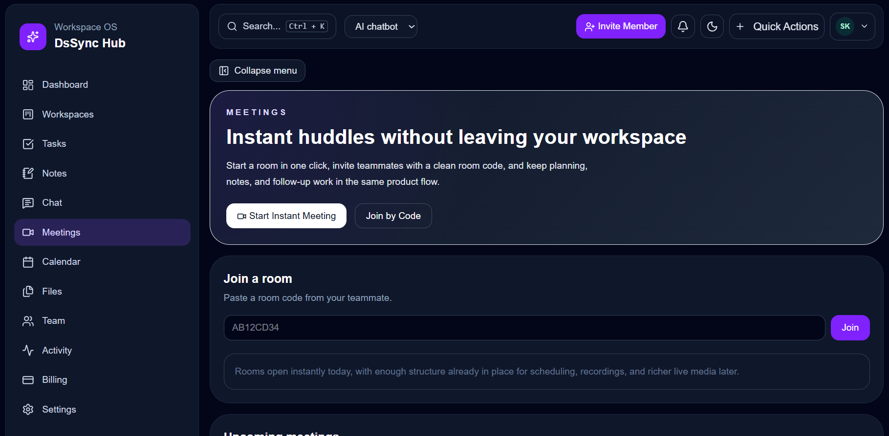

# DsSync Hub 🚀

A production-style full-stack SaaS collaboration platform built for modern teams to manage tasks, notes, communication, billing, and workspace workflows in one place.

DsSync Hub demonstrates real-world MERN engineering with secure authentication, payment integration, scalable backend APIs, polished UI, and portfolio-ready product thinking.

---

## 🌐 Live Demo

* **Frontend:** [https://dssync-hub-client.vercel.app](https://dssync-hub-client.vercel.app)
* **Backend API:** [https://dssync-hub-api.onrender.com](https://dssync-hub-api.onrender.com)

---

## ✨ Key Features

### 🔐 Authentication

* Email / Username / Phone login
* Secure signup flow
* JWT authentication
* Google Sign In
* Forgot / Reset password

### 👥 Workspace System

* Create and manage workspaces
* Multi-workspace support
* Invite team members
* Role-ready architecture

### ✅ Task Management

* Create / edit / delete tasks
* Status workflows
* Priority levels
* Search and filtering

### 📝 Notes Module

* Create and manage notes
* Autosave-ready architecture
* Organized workspace notes

### 💬 Team Chat

* Team communication UI
* Channel-ready structure
* Real-time architecture ready

### 💳 Billing

* Free & Pro plans
* Razorpay checkout integration
* Subscription state handling

### ⚙️ Settings

* Profile updates
* Security settings
* Theme preferences

---

## 🛠 Tech Stack

### Frontend

* React
* TypeScript
* Vite
* Tailwind CSS
* Redux Toolkit
* React Router
* Axios

### Backend

* Node.js
* Express.js
* MongoDB Atlas
* Mongoose
* JWT
* REST APIs

### Integrations

* Google OAuth
* Razorpay
* Nodemailer
* Groq AI API

---

## 📸 Screenshots

### 🏠 Homepage



### 🔐 Login Page



### 📝 Signup Page



### 📊 Dashboard



### ✅ Task Management



### 🗒 Notes Module



### 💬 Chat Page



### 💳 Billing Page



### ⚙️ Settings Page



### 🎥 Meeting Page



---

## 📁 Project Structure

```text
DsSyncHub/
├── client/          Frontend React application
├── server/          Backend Express API
├── screenshots/     UI screenshots
├── docs/            Project documentation
├── README.md
└── .gitignore
```

---

## ⚙️ Environment Variables

Before running the project, create `.env` files and replace all placeholder values with your own real credentials / API keys.


### Backend (`server/.env`)

```env
PORT=5000
MONGO_URI=your_mongodb_uri
CLIENT_URL=http://localhost:5173
JWT_SECRET=your_secret
JWT_EXPIRES_IN=7d
NODE_ENV=development
GOOGLE_CLIENT_ID=your_google_client_id
EMAIL_USER=your_email@gmail.com
EMAIL_PASS=your_app_password
EMAIL_FROM=your_email@gmail.com
RAZORPAY_KEY_ID=your_key
RAZORPAY_KEY_SECRET=your_secret
GROQ_API_KEY=your_key
```

### Frontend (`client/.env`)

```env
VITE_API_URL=http://localhost:5000/api
VITE_APP_NAME=DsSync Hub
VITE_GOOGLE_CLIENT_ID=your_google_client_id
VITE_RAZORPAY_KEY_ID=your_key
```

---

## 🚀 Run Locally

### 1️⃣ Install Dependencies

```bash
cd client
npm install

cd ../server
npm install
```

### 2️⃣ Start Backend

```bash
cd server
npm run sync:indexes
npm run dev
```

### 3️⃣ Start Frontend

```bash
cd client
npm run dev
```

---

## 🧪 Testing Checklist

* Signup works
* Login works
* Google Sign In works
* Forgot password works
* Task CRUD works
* Notes CRUD works
* Billing works
* Logout works
* Responsive UI works

---

## 🚀 Deployment

### Frontend

Deploy on **Vercel**

### Backend

Deploy on **Render / Railway**

### Database

Use **MongoDB Atlas**

---

## 📈 Why This Project Matters

This project demonstrates:

* Full-stack MERN development
* Secure auth architecture
* REST API engineering
* Payment gateway integration
* State management
* Scalable folder structure
* Real product UI/UX thinking
* Deployment readiness

---

## 🔮 Future Improvements

* Real-time Socket chat
* File uploads
* Notifications center
* Calendar sync
* Analytics dashboard
* Admin controls
* AI productivity assistant

---

## 👨‍💻 Author

Digvijay Kumar Singh

---

## 🔗 Connect

LinkedIn: https://www.linkedin.com/in/digvijaykumarsingh
GitHub: https://github.com/chauhandigvijay1
Email: [chauhandigvijay669@gmail.com](mailto:chauhandigvijay669@gmail.com)

---

## ⭐ Support

If you found this project helpful, consider giving it a star ⭐

---