<div align="center">
  
</div>

<div align="center">
  <h1>DsSync Hub</h1>
  <p><strong>Open-Source SaaS Collaboration Platform for Modern Teams</strong></p>
  <p>
    <a href="https://dssync-hub-client.vercel.app">Live Demo</a> ·
    <a href="docs/ARCHITECTURE.md">Architecture</a> ·
    <a href="docs/API.md">API Docs</a> ·
    <a href="docs/CHALLENGES.md">Challenges</a> ·
    <a href="docs/SECURITY.md">Security</a>
  </p>
</div>

<p align="center">
  
  
  
  
  
  
  
  
  
  
  
  
  
  
  
  
</p>

---

## Overview

DsSync Hub is a **production-grade, multi-tenant SaaS collaboration platform** engineered for teams that need task management, real-time communication, document collaboration, video meetings, AI assistance, and billing — all in one unified workspace.

Built with a **MERN + TypeScript** stack and hardened for production with **Redis caching**, **Sentry error monitoring**, **Cloudinary media storage**, **Jitsi Meet video**, **Socket.io real-time sync**, **Pino structured logging**, **Bull email queue**, and **CI/CD pipelines**.

---

## Screenshots

<details>
<summary><strong>Click to view screenshots</strong> (21 images)</summary>

<br/>

| Landing | Sign Up | Log In |
|---------|---------|--------|
| 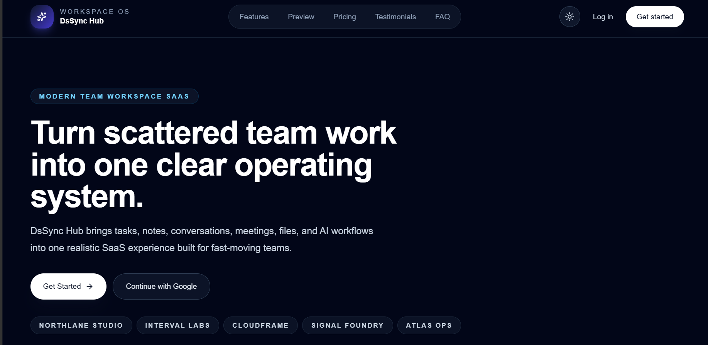 | 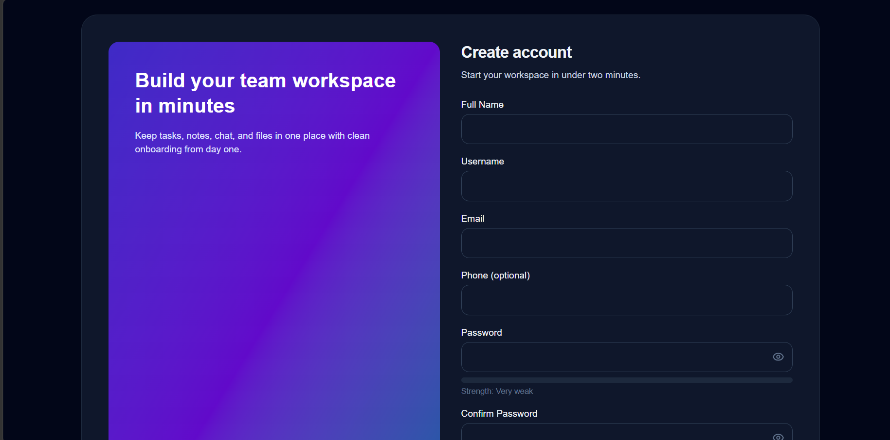 | 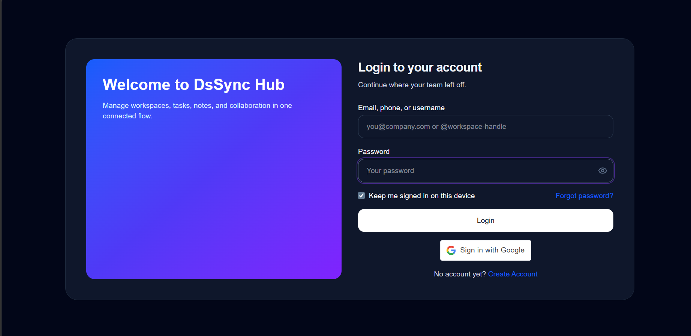 |

| Dashboard | Tasks | Notes |
|-----------|-------|-------|
| 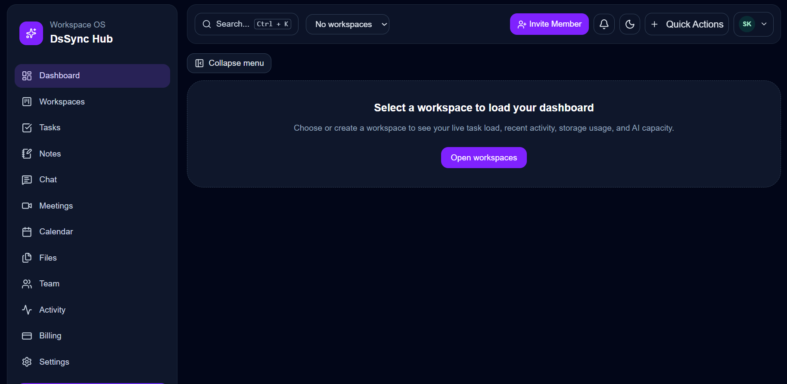 | 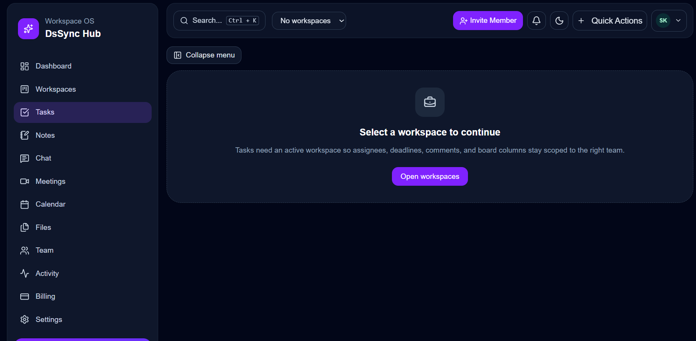 | 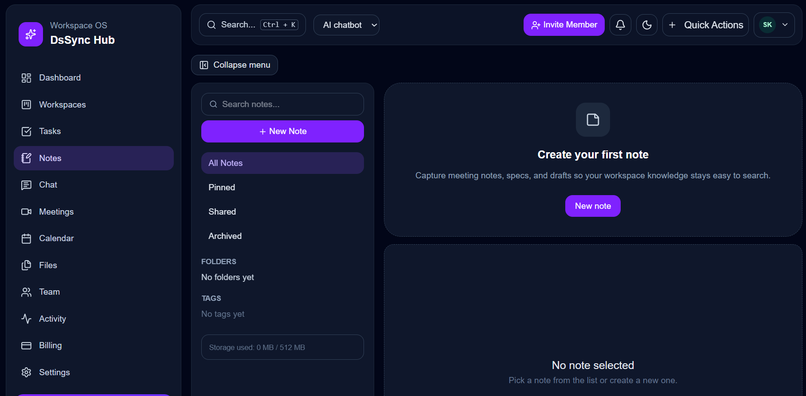 |

| Chat | Calendar | Meetings |
|------|----------|----------|
| 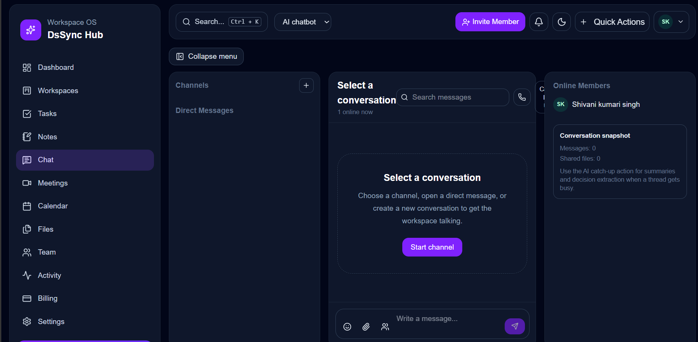 |  | 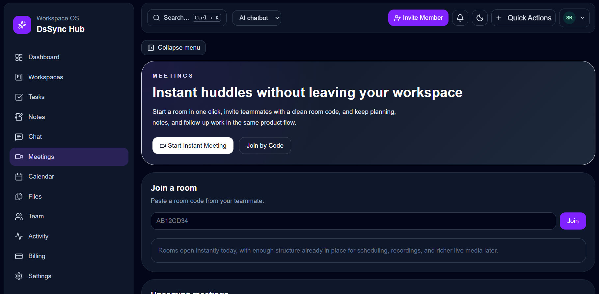 |

| Files | Team | Workspace Details |
|-------|------|-------------------|
|  |  |  |

| Billing | Settings | Admin Panel |
|---------|----------|-------------|
| 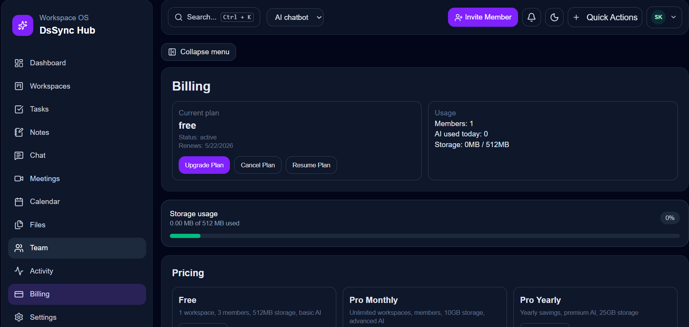 | 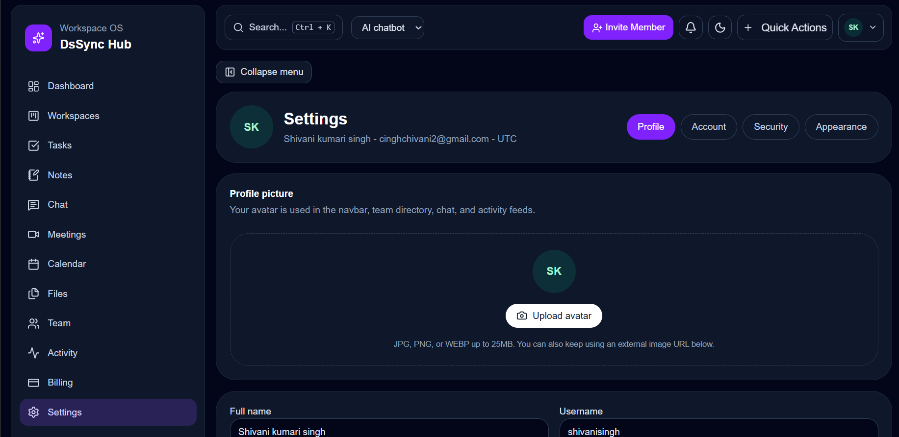 |  |

| Notifications | Activity | AI Assistant |
|---------------|----------|--------------|
|  |  |  |

| Terms of Service | Privacy Policy | Data Export |
|------------------|----------------|-------------|
|  |  |  |

</details>

---

## Features

### Collaboration Suite

| Module | Capabilities | Real-Time |
|--------|-------------|-----------|
| **Tasks** | Kanban board, priority levels, status workflows, due dates, assignees, labels, filters, search, comments with mentions | Socket.io sync across all connected clients |
| **Notes** | Rich text editor, workspace organization, tags, folders, shareable links with public access, version tracking, pin/unpin | Socket.io sync across all connected clients |
| **Chat** | Channel-based messaging, typing indicators, message editing/deletion, file attachments, reply-to threading, reactions, seen-by tracking, direct messaging | Socket.io bidirectional communication |
| **Calendar** | Event CRUD with date-range queries, source tracking, color coding, linked entities (tasks + events merged), month/week/agenda views | Socket.io broadcast on create/update/delete |
| **Meetings** | Jitsi Meet iframe embed — completely free, no account required, HD video/audio, screen sharing, in-call chat, raise hand, background blur | Real-time via Jitsi external API |

### Authentication & Security

- Email/password registration with bcrypt (12 rounds)
- Google OAuth 2.0 with Google Identity Services
- JWT access tokens with token versioning for session invalidation
- Forgot/reset password flow with SHA-256 hashed tokens + 60-min expiry
- Email verification flow with dedicated VerifyEmailPage
- Input sanitization stripping `<>{}$` to prevent XSS across all inputs
- Helmet security headers + CORS whitelist + httpOnly cookies (sameSite none in prod)
- Rate limiting: global (500/15min) + login (8/15min) — distributed via Redis when configured
- No stack traces in production error handler
- Uncaught exception/rejection handlers for graceful shutdown

### Workspace Multi-Tenancy

Every resource (tasks, notes, messages, files, calendar events) is scoped to a workspace. All 17 controllers enforce membership checks before any operation. Four roles: `owner`, `admin`, `member`, `viewer`. Invites generate secure tokens with 7-day expiry and send real emails via Nodemailer with HTML templates.

### Admin Panel

- Platform-wide statistics dashboard (total users, workspaces, active subscriptions)
- User management with search, pagination, role promotion/demotion, and deletion
- Workspace overview with member counts and plan badges
- Role-based access — only `admin` role can access the `/admin` route

### Data Export

- One-click ZIP download of all workspace data (tasks, notes, messages, calendar events, file metadata) as structured JSON
- GDPR-compliant — users own their data and can export it at any time

### Billing & Monetization

- Razorpay payment gateway integration (test mode ready)
- Free / Pro Monthly (₹999) / Pro Yearly (₹9999) tiers
- Plan-based storage limits, member caps, and AI usage quotas
- Invoice tracking with downloadable URLs
- Subscription state management with cancel/resume

### AI Integration

- Groq-powered AI assistant (llama-3.1-8b-instant) with multi-API-key fallback
- Six functions: summarize notes, improve writing, convert text to tasks, summarize chat messages, sprint planning, task prioritization
- Per-workspace daily usage quotas (Free=10, Pro Monthly=300, Pro Yearly=500)
- 12-second timeout with silent fallback on failure

### Legal Pages

- `/terms` — Terms of Service page (8 sections)
- `/privacy` — Privacy Policy page (9 sections: data collection, cookies, GDPR rights, third-party services)

### Infrastructure

- **Pino Logger** — Structured JSON logging with configurable levels, password/token redaction, request/response serializers, pino-pretty in development, JSON in production
- **Redis** — Distributed rate limiting, Socket.io adapter, Bull queue backend — all guarded when `REDIS_URL` unset (graceful fallback)
- **Sentry** — Error monitoring with 20% traces sample rate in production — guarded when `SENTRY_DSN` unset
- **Cloudinary** — Cloud media storage with automatic local fallback + production warning — guarded when API keys unset
- **Bull Email Queue** — Async email dispatch (password-reset, verify-email, invite) with 3 retries and exponential backoff — falls back to direct send when Redis unconfigured
- **Cron Jobs** — Expired token cleanup (invite/password/verify tokens) runs every 6 hours via `node-cron`
- **API Versioning** — All 17 route modules mounted under both `/api` and `/api/v1`
- **CI/CD** — GitHub Actions: 92 backend tests + frontend build on every push/PR to main

---

## Architecture

```
┌─────────────────────────────────────────────────────────────┐
│                    Client (Vercel)                          │
│  React 19 · TypeScript 6 · Vite 8 · Tailwind 4 · RTK 2    │
│  Socket.io-client · React Router 7 · React Hook Form + Zod │
└──────────────────────┬──────────────────────────────────────┘
                       │ REST + WebSocket
                       ▼
┌─────────────────────────────────────────────────────────────┐
│                    Server (Render)                           │
│  Node.js 20 · Express 5 · Mongoose 8 · Socket.io 4 · JWT   │
│                                                             │
│  ┌──────────┐ ┌──────────┐ ┌──────────┐ ┌───────────────┐  │
│  │ Routes   │ │ Middleware│ │ Services │ │ Socket (4)    │  │
│  │ (17)     │ │ (6)      │ │ (6)      │ │ Chat/Task/    │  │
│  │          │ │          │ │          │ │ Note/Calendar │  │
│  └──────────┘ └──────────┘ └──────────┘ └───────────────┘  │
│                                                             │
│  Optional: Redis · Bull · Sentry · Cloudinary               │
└──────────────────────┬──────────────────────────────────────┘
                       │
                       ▼
              ┌────────────────┐
              │  MongoDB Atlas │
              │  (17 models)   │
              └────────────────┘
```

Full architecture deep-dive at [docs/ARCHITECTURE.md](docs/ARCHITECTURE.md).

---

## Tech Stack

### Frontend

| Technology | Purpose |
|------------|---------|
| **React 19** | UI library with concurrent features, server components ready |
| **TypeScript 6** | Strict mode, full type safety across 13 type modules |
| **Vite 8** | Sub-second HMR, optimized production builds with vendor chunking |
| **Tailwind CSS 4** | Utility-first styling, dark mode via class strategy, custom design system |
| **Redux Toolkit 2** | Global state management with 16 slices, createAsyncThunk + createSlice |
| **React Router 7** | Declarative routing with lazy-loaded pages for code splitting |
| **React Hook Form + Zod** | Type-safe form validation with schema-based error messages |
| **Socket.io-client** | Real-time bidirectional communication with auto-reconnect |
| **Lucide React** | Lightweight, consistent icon library |
| **@sentry/react** | Frontend error monitoring with performance traces |

### Backend

| Technology | Purpose |
|------------|---------|
| **Node.js 20** | JavaScript runtime, CommonJS modules |
| **Express 5** | HTTP server, middleware pipeline, REST routing with 17 route modules |
| **Mongoose 8** | MongoDB ODM with schema validation, compound indexes, population |
| **MongoDB Atlas** | Managed document database with replica sets, SRV→direct DNS fallback |
| **Socket.io 4** | WebSocket server with rooms, namespaces, JWT auth, presence tracking |
| **JWT + bcrypt** | Token-based auth with token versioning, 12-round password hashing |
| **Nodemailer** | SMTP email delivery with HTML templates (reset, verify, invite) |
| **Razorpay** | Payment gateway with HMAC SHA-256 signature verification |
| **Google Auth Library** | OAuth 2.0 token verification (Google Identity Services) |
| **Multer** | Multipart file uploads (memory storage, 25MB limit, 29 MIME types) |
| **Pino** | Structured JSON logging with redaction, serializers, and pino-http |
| **Bull** | Redis-backed job queue for async email dispatch with retry |
| **adm-zip** | In-memory ZIP generation for data export |
| **node-cron** | Scheduled task execution for token cleanup |
| **ioredis** | Redis client with retry strategy for rate limiting + socket adapter |

### Infrastructure

| Service | Purpose | Guard |
|---------|---------|-------|
| **Redis** | Distributed rate limiting, Socket.io adapter, Bull queue | Skipped when `REDIS_URL` unset |
| **Sentry** | Error monitoring, performance tracing (0.2 sample rate) | Skipped when `SENTRY_DSN` unset |
| **Cloudinary** | Cloud media storage with CDN delivery, image transformations | Falls back to local when API keys unset |
| **Bull** | Background email job queue | Falls back to direct send when Redis unset |
| **Jitsi Meet** | Free, open-source video conferencing (meet.jit.si) | Always on — no account required |

### DevOps

- **Vercel** — Frontend hosting with automatic SSL, global CDN, preview deploys per branch
- **Render** — Backend hosting with auto-deploy from GitHub, persistent MongoDB connection
- **GitHub Actions** — CI/CD: 92 backend tests + frontend build/lint on every push and PR
- **Git** — Branch protection, conventional commit messages, GitHub Secrets for env vars

---

## Database Schema (17 Models)

```
User ───────────┐
├─ Membership ──┤── Workspace
├─ Notification │   ├─ Task ─── TaskComment
├─ AiUsage      │   ├─ Note
├─ Subscription │   ├─ Message ─── Channel
├─ BillingInvoice│   ├─ FileAsset
└─ Invite       │   ├─ CalendarEvent
                │   ├─ Meeting
                │   └─ ActivityLog
                └──┘
```

Every resource belongs to a workspace. Access is enforced via the `Membership` join table with roles: `owner`, `admin`, `member`, `viewer`.

---

## API Overview (17 Route Modules)

| Module | Endpoints | Auth |
|--------|-----------|------|
| Auth | Register, Login, Google, Logout, Forgot/Reset Password, Verify Email, Send Verification | Mixed |
| Users | Profile CRUD, Change Password, Upload Avatar, Logout All | JWT |
| Workspaces | CRUD, Invite Member, Join by Code, List Members, Update/Remove Member | Mixed |
| Tasks | CRUD, Move Status, Complete, Archive | JWT |
| Notes | CRUD, Pin, Archive, Duplicate, Public Share | JWT |
| Chat | Messages CRUD, Edit, Delete, Reactions | JWT |
| Channels | CRUD with workspace-scoped unique slug | JWT |
| Calendar | CRUD with date-range filtering, color coding | JWT |
| Meetings | Room CRUD, Join Metadata, Upcoming List | JWT |
| Files | Upload, List, Stream/Download, Delete | JWT |
| Billing | Plans, Create Order, Verify Payment, Invoices, Cancel Subscription | JWT |
| AI | Summarize, Rewrite, Generate Tasks | JWT |
| Search | Global search across tasks, notes, users, files | JWT |
| Notifications | List, Mark Read, Mark All Read, Delete | JWT |
| Activity | List with actor population, filter by entity | JWT |
| Admin | Stats, Users CRUD, Workspaces List, Role Update | JWT + Admin |
| Export | Download workspace data as ZIP | JWT |

All routes are also available at `/api/v1/*` for API versioning (backward-compatible).

Full API reference at [docs/API.md](docs/API.md).

---

## Quick Start

### Prerequisites

- Node.js 20+
- MongoDB Atlas account (free tier — SRV connection string)
- Google OAuth Client ID (for social login — see setup below)
- Razorpay test keys (for billing)
- Gmail App Password (for password reset, verification, and invite emails)

### Google Console Setup

1. Go to [Google Cloud Console → Credentials](https://console.cloud.google.com/apis/credentials)
2. Create or select an **OAuth 2.0 Web Client**
3. Under **Authorized JavaScript Origins** add:
   - `http://localhost:5173` (local development)
   - `https://dssync-hub-client.vercel.app` (production)
4. Copy the **Client ID** and set it identically in both:
   - `server/.env`: `GOOGLE_CLIENT_ID=<your-client-id>`
   - `client/.env`: `VITE_GOOGLE_CLIENT_ID=<your-client-id>`

### Installation

```bash
# Clone
git clone https://github.com/chauhandigvijay1/DsSyncHub.git
cd DsSyncHub

# Install dependencies
cd client && npm install && cd ../server && npm install && cd ..

# Configure environment (copy .env.example to .env in both directories)
# Start backend
cd server && npm run dev

# In a new terminal, start frontend
cd client && npm run dev
```

Visit **http://localhost:5173** — the app loads with a working backend at **http://localhost:5000**.

### Environment Variables

- **Server**: See [server/.env.example](server/.env.example) for all required and optional vars
- **Client**: See [client/.env.example](client/.env.example) for all required and optional vars

**Important**: The same `GOOGLE_CLIENT_ID` (server) and `VITE_GOOGLE_CLIENT_ID` (client) must match. Both `RAZORPAY_KEY_ID` values must also match.

Full installation guide at [docs/INSTALLATION.md](docs/INSTALLATION.md).

---

## Deployment

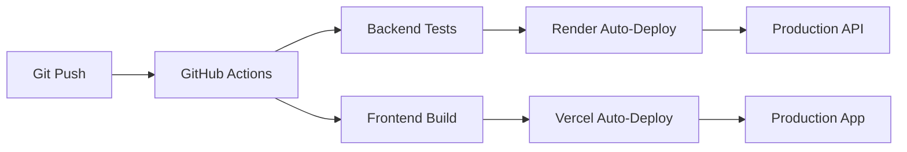
```mermaid
graph LR
    A[Git Push] --> B[GitHub Actions]
    B --> C[Backend Tests]
    B --> D[Frontend Build]
    C --> E[Render Auto-Deploy]
    D --> F[Vercel Auto-Deploy]
    E --> G[Production API]
    F --> H[Production App]
```

1. Push to `main` → GitHub Actions runs 92 tests + frontend build
2. Render watches the repo → auto-deploys server
3. Vercel watches the repo → auto-deploys client

### Env Variables for Production

| Variable | Render (Server) | Vercel (Client) |
|----------|----------------|-----------------|
| `MONGO_URI`, `JWT_SECRET`, `JWT_EXPIRES_IN` | Copy from local `.env` | — |
| `CLIENT_URL` | `https://dssync-hub-client.vercel.app` | — |
| `NODE_ENV` | `production` | — |
| `GOOGLE_CLIENT_ID` | Copy from `.env` | — |
| `EMAIL_USER/PASS/FROM` | Copy from `.env` | — |
| `RAZORPAY_KEY_ID/SECRET` | Copy from `.env` | — |
| `GROQ_API_KEY` | Copy from `.env` | — |
| `SENTRY_DSN` | Created from Sentry account | — |
| `CLOUDINARY_CLOUD_NAME/API_KEY/API_SECRET` | Created from Cloudinary account | — |
| `REDIS_URL` | From Upstash free tier | — |
| `LOG_LEVEL` | `info` | — |
| `VITE_API_URL` | — | `https://dssync-hub-api.onrender.com/api` |
| `VITE_GOOGLE_CLIENT_ID` | — | Same as server `GOOGLE_CLIENT_ID` |
| `VITE_RAZORPAY_KEY_ID` | — | Same as server `RAZORPAY_KEY_ID` |
| `VITE_SENTRY_DSN` | — | Created from Sentry account |
| `VITE_APP_NAME` | — | `DsSync Hub` |

Detailed deployment guide at [docs/DEPLOYEMENT.md](docs/DEPLOYEMENT.md).

---

## Testing

| Layer | Tool | Tests | Coverage |
|-------|------|-------|----------|
| **Unit** (server) | Node `--test` | 4 | Validators (email, username, phone, password) |
| **Unit** (client) | Vitest | 5 | Error utils, Redux auth reducer |
| **Integration** (supertest) | Node `--test` | 69 | Auth enforcement on all 17 controllers (401 rejection) |
| **Integration** (mongodb-memory-server) | Node `--test` | 15 | Positive flow: register → login → workspace CRUD → task/note/calendar/meeting CRUD |
| **E2E** | Playwright | 2 | Auth page rendering (signup, login, forgot/reset) |

**Total: 92 server tests + 5 client tests + 2 E2E smoke tests**

```bash
# Run all server tests
cd server && npm test

# Run client unit tests
cd client && npm test

# Run E2E tests (requires running app)
cd client && npm run test:e2e
```

---

## Security Posture

- **Authentication**: JWT with token versioning, bcrypt (12 rounds), SHA-256 reset tokens
- **Authorization**: Membership-based RBAC on every endpoint (owner/admin/member/viewer)
- **Input Validation**: Custom sanitizer stripping `<>{}$` across all inputs
- **XSS Prevention**: Note content sanitized for script/style/iframe/object/embed + event handlers
- **Rate Limiting**: Global 500/15min + auth 8/15min (Redis-backed when configured)
- **Headers**: Helmet with CSP, CORS whitelist, production cross-origin resource policy
- **Cookies**: httpOnly, sameSite, secure in production
- **Errors**: No stack traces in production, Sentry capture
- **Database**: Parameterized queries via Mongoose, no raw injection
- **Session Management**: tokenVersion increment logs out all sessions

Full security documentation at [docs/SECURITY.md](docs/SECURITY.md).

---

## Technical Challenges & Solutions

Detailed write-up at [docs/CHALLENGES.md](docs/CHALLENGES.md).

| Challenge | Solution |
|-----------|----------|
| Jitsi Meet mock → real integration | Dynamic `external_api.js` script load with clean lifecycle management |
| Multi-API-key AI fallback | Comma-separated `GROQ_API_KEY` env var with sequential retry + 100ms delay |
| Ephemeral Render storage | Cloudinary integration with automatic local fallback + production warning |
| Real-time calendar sync | Socket.io events + Redux reducers with membership verification |
| Sentry middleware ordering | Conditional init: requestHandler before routes, errorHandler after |
| File upload workspace isolation | `uploads/{workspaceId}/{filename}` with backward-compatible routes |
| Multi-tenant data isolation | Membership-based query filtering on all 17 controllers |
| Concurrent note editing | Socket.io broadcast + queryCommandSupported guard for links |
| Testing without MongoDB | mongodb-memory-server for isolated, fast integration tests |
| Email deliverability | Bull queue with 3 retries (exponential backoff), falls back to direct send |
| API versioning | All routes mounted under `/api` and `/api/v1` via mountRoutes() |

---

## Roadmap

See [docs/ROADMAP.md](docs/ROADMAP.md) for the full product vision.

**Next priorities:**
1. Docker Compose for reproducible local development
2. Database migration/seeding script for demo data
3. OpenAPI/Swagger specification

---

## Why This Project Matters

DsSync Hub is not a tutorial project. It is a **production-grade SaaS foundation** that demonstrates:

- **Systems thinking**: Multi-tenant workspace architecture with proper data isolation, membership-based authorization, and cross-resource relationships across 17 models
- **Security-first engineering**: Defense-in-depth with input sanitization, rate limiting, token versioning, Helmet headers, and no secrets exposure
- **Real-time at scale**: Socket.io rooms scoped to workspaces across 4 socket modules with JWT auth, membership verification, and Redux integration
- **Production infrastructure**: Redis, Sentry, Cloudinary, Bull queue, Pino logging, CI/CD — all with graceful fallbacks when unconfigured
- **Third-party integration**: Google OAuth, Razorpay payments, Groq AI, Jitsi Meet, Nodemailer — all wired to real APIs with proper error handling
- **Frontend craft**: React 19, TypeScript strict, RTK 16 slices, Tailwind design system, responsive to 320px, lazy-loaded routes
- **Testing maturity**: 97 test cases spanning unit, integration (with in-memory DB), auth enforcement, and positive flows

---

## License

ISC — free to use, modify, and deploy.

---

## Author

**Digvijay Kumar Singh**

[](https://www.linkedin.com/in/digvijaykumarsingh)
[](https://github.com/chauhandigvijay1)
[](mailto:chauhandigvijay669@gmail.com)

---

<p align="center">
  If you found this project valuable, consider giving it a <strong>star</strong> ⭐<br/>
  <sub>Built with care — not for a tutorial, but for real teams.</sub>
</p>
