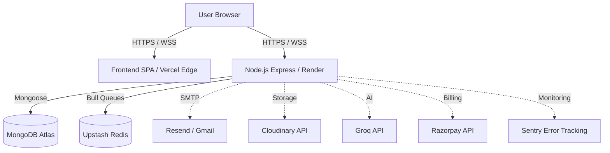
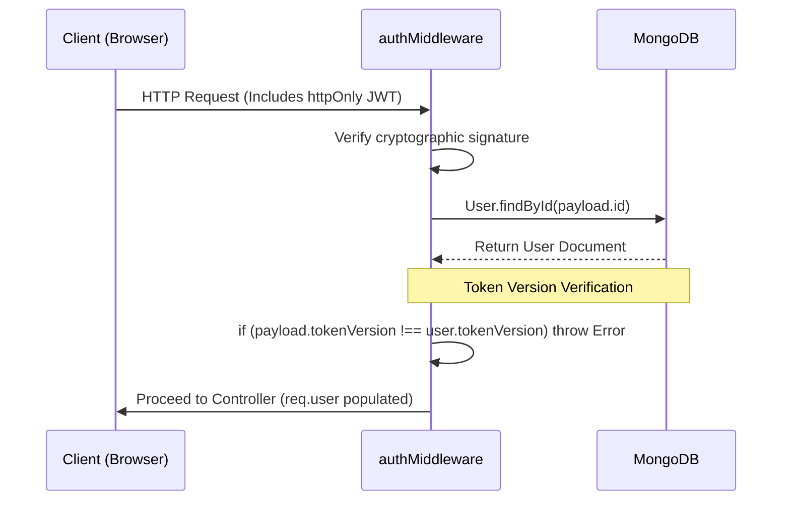
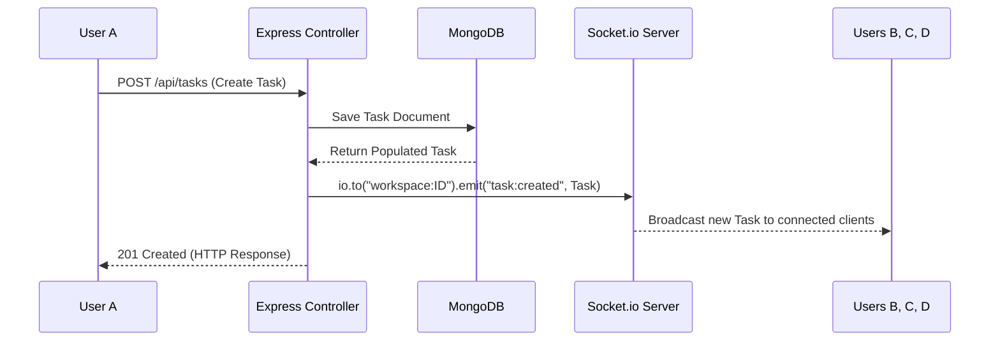
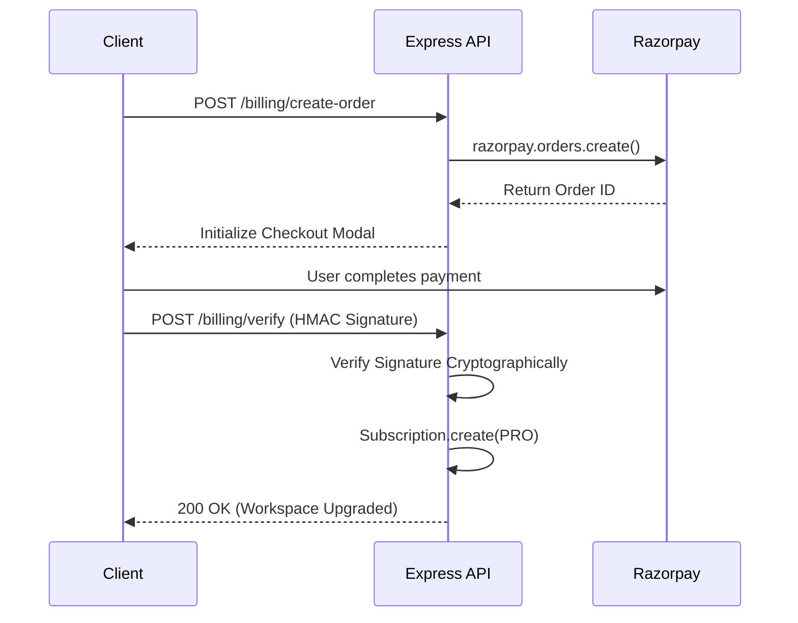

  
  <h1>System Architecture Blueprint</h1>
  
<strong>A deep dive into the pipelines, data models, and real-time infrastructure powering DsSync Hub.</strong>

---

## 1. System Topology

DsSync Hub operates on a decoupled architecture, leveraging managed cloud services to achieve high availability with zero baseline hosting costs.

---

## 2. Core Data Model & Indexing

The data model strictly enforces a **Multi-Tenant Boundary** through the `Workspace` entity. All collaborative assets are scoped to a workspace ID.

### Entity Hierarchy
- **`User`**: Core identity (Auth, Token Versioning, Preferences).
- **`Workspace`**: The organizational boundary.
  - **`Membership`**: Pivot table associating Users to Workspaces with specific RBAC roles (`owner`, `admin`, `member`, `viewer`).
  - **`Task` / `Note`**: Productivity assets.
  - **`Channel` / `Message`**: Communication assets.
  - **`FileAsset`**: Upload abstraction tracking Cloudinary vs Local storage.
  - **`ActivityLog`**: Immutable audit trails.

### High-Performance Query Strategy
To guarantee O(1) lookups and prevent multi-tenant data bleed, compound indexes are strictly enforced at the database level:
- `Membership: { user: 1, workspace: 1 }` *(Unique)*
- `Task: { workspace: 1, status: 1, order: 1 }`
- `Message: { workspace: 1, channel: 1, createdAt: -1 }`
- `ActivityLog: { workspace: 1, createdAt: -1 }`

---

## 3. The Authentication Pipeline

Authentication utilizes stateless JSON Web Tokens (JWT) stored securely in `httpOnly` cookies, paired with database-level **Token Versioning** for instant session invalidation.

**Why Token Versioning?**
If a user clicks "Logout All Devices" or changes their password, the database `tokenVersion` increments. All existing JWTs immediately become invalid because their payload version no longer matches the database, solving the core weakness of stateless JWTs.

---

## 4. The Real-Time WebSocket Engine

To prevent data races (where the REST API and Socket API emit conflicting data), DsSync Hub utilizes a centralized, unidirectional emission pattern.

This guarantees that the database is always the absolute source of truth before any UI state is updated.

---

## 5. Third-Party Pipelines

### File Storage Abstraction
The backend implements a dual-storage strategy to survive the ephemeral file systems of free-tier hosts like Render.
1. `multer` buffers the incoming file in memory (checking MIME types and a 25MB limit).
2. The `storageService` streams the buffer directly to **Cloudinary**.
3. If Cloudinary is unconfigured (local development), it gracefully falls back to local disk storage (`uploads/`).

### Razorpay Billing Flow

### AI Integration (Assume Failure)
The Groq LLM integration operates on a strict "Assume Failure" pattern.
- The `aiService` expects a comma-separated list of API keys.
- If a request fails (or hits the strict 12-second timeout), the service catches the error, delays for 100ms, and automatically retries using the *next* API key in the rotation. 
- A custom `aiUsageLimit` middleware tracks all requests to prevent workspace quota abuse.

---

## 6. Infrastructure & Cost

The entire architecture is designed to run seamlessly on generous free-tier cloud platforms.

| Service | Configuration | Monthly Cost |
|---------|---------------|--------------|
| **Vercel** | SPA Edge deployment (`npm run build`) | $0 |
| **Render** | Node.js Web Service (Sleeps on idle) | $0 |
| **MongoDB Atlas** | M0 Cluster (512MB limit) | $0 |
| **Cloudinary** | 25GB Storage / Bandwidth limit | $0 |
| **Upstash Redis** | 10k commands/day | $0 |

---

  <a href="backend.md">← Previous: Backend</a> | <a href="../README.md">🏠 Home</a> | <a href="testing.md">Next: Testing →</a>

