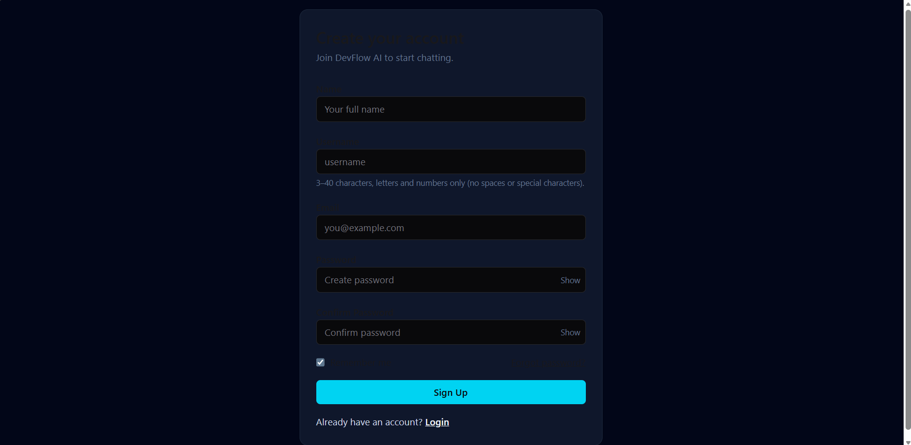
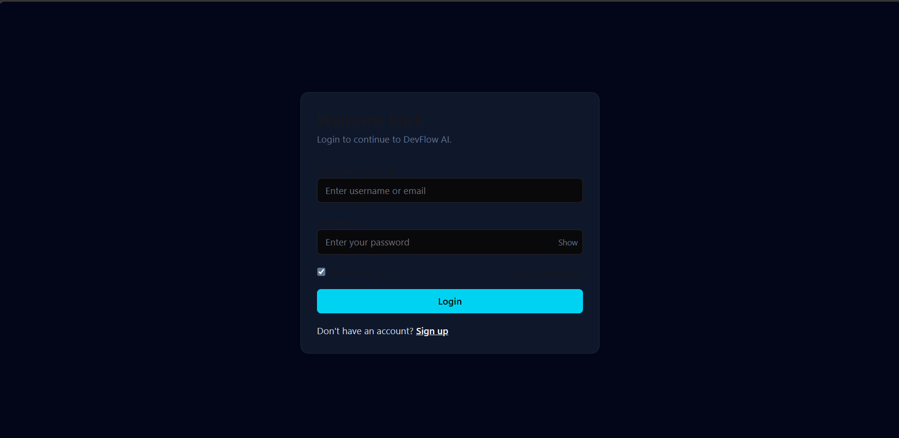
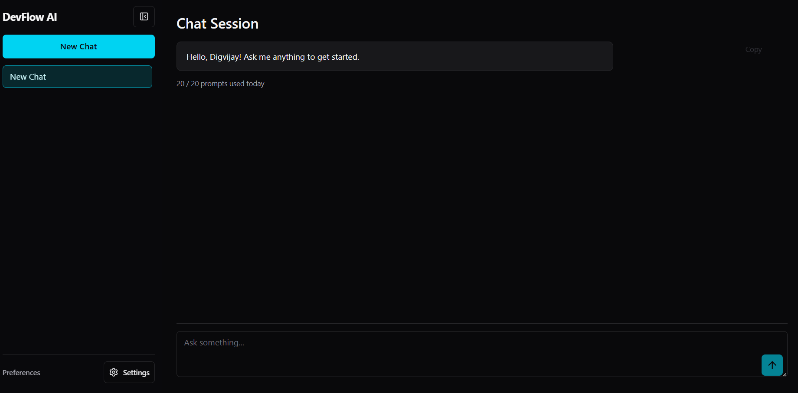
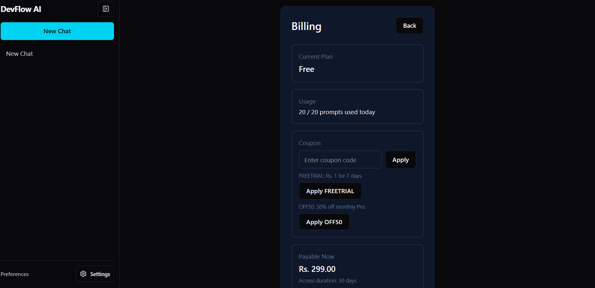
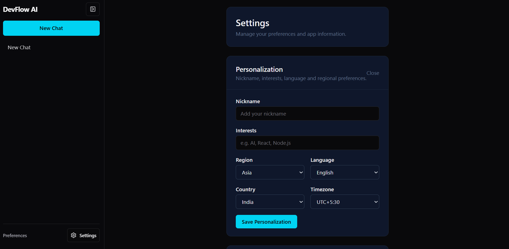

# DevFlow AI 🚀

DevFlow AI is a full-stack SaaS application that allows users to interact with an AI-powered chat system, manage usage limits, and upgrade plans through integrated billing.

The project is built using a modern MERN + Next.js stack and deployed on Netlify (frontend) and Render (backend).

---

## 🌐 Live Demo

* Frontend (Netlify): https://devflow-ai-client.netlify.app
* Backend API (Render): https://devflow-api-ubnd.onrender.com

---

## 🎬 Demo Video

Watch the complete project walkthrough:
https://drive.google.com/file/d/1i_7GaBoV9wYduITWSZtkO-jt4Ic7SoVD/view?usp=sharing

---

## 📸 Screenshots

### Authentication

### Chat System

### Billing

### Settings

---

## 📚 API Documentation

Detailed API endpoints and usage:
👉 ./API.md

---

## 📌 Features

### Authentication

* User Signup & Login
* Secure password handling
* Forgot Password & Reset Password
* Unique username validation

### AI Chat System

* Create and manage chats
* Real-time message interaction
* Chat history persistence
* Auto-scroll and responsive UI

### Usage Limits

* Free plan with daily limits
* Usage tracking per user
* Backend + frontend enforcement

### Billing & Subscription

* Razorpay payment integration
* Upgrade to Pro plan
* Subscription stored in database

### User Settings

* Profile management
* Account configuration
* Plan details

---

## 🛠️ Tech Stack

Frontend:

* Next.js
* React
* Tailwind CSS

Backend:

* Node.js
* Express.js
* MongoDB (Mongoose)

Integrations & Tools:

* Groq API (AI Chat)
* Razorpay (Payments)
* JWT (Authentication)
* Cloudinary (Media Handling)
* Netlify (Frontend Hosting)
* Render (Backend Hosting)

---

## 📂 Project Structure

devflow-ai/
│
├── client/          # Frontend (Next.js)
├── server/          # Backend (Express + MongoDB)
│
├── API.md           # API Documentation
├── Screenshots/     # Project Screenshots
└── README.md

---

## ⚙️ Environment Variables

### Backend (.env)

PORT=5000
MONGO_URI=your_mongodb_connection_string
JWT_SECRET=your_secret_key
CLIENT_URL=https://devflow-ai-client.netlify.app

RAZORPAY_KEY_ID=your_key
RAZORPAY_KEY_SECRET=your_secret

---

### Frontend (.env.local)

NEXT_PUBLIC_API_URL=https://devflow-api-ubnd.onrender.com

---

## 🚀 Getting Started (Local Setup)

### 1. Clone Repository

git clone https://github.com/chauhandigvijay1/web-dev-journey.git
cd web-dev-journey/Real-world-projects/devflow-ai

---

### 2. Install Dependencies

Backend:
cd server
npm install

Frontend:
cd ../client
npm install

---

### 3. Run Project

Start Backend:
cd server
npm run dev

Start Frontend:
cd client
npm run dev

---

### 4. Open Browser

http://localhost:3000

---

## 🔧 Deployment

Frontend (Netlify):

* Connected GitHub repo
* Auto deploy on push
* Env variable: NEXT_PUBLIC_API_URL

Backend (Render):

* Node.js web service
* Auto deploy on push
* Env variables configured in dashboard

---

## 🐛 Common Issues & Fixes

CORS Error:

* Ensure CLIENT_URL is correct
* Allow Netlify domain in backend

500 Errors:

* Check MongoDB connection
* Verify env variables
* Match schema properly

Deployment Issues:

* Avoid wildcard (*) routes
* Always use process.env.PORT || 5000

---

## 📈 Future Improvements

* Streaming AI responses
* Better UI animations
* Admin dashboard
* Analytics system

---

## 🤝 Contributing

Feel free to fork the repo and create pull requests.

---

## 📄 License

MIT License

---

## 👨‍💻 Author

Digvijay Kumar Singh

---

## 🔗 Connect

LinkedIn: https://www.linkedin.com/in/digvijaykumarsingh
GitHub: https://github.com/chauhandigvijay1
Email: [chauhandigvijay669@gmail.com](mailto:chauhandigvijay669@gmail.com)

---

## ⭐ Support

If you found this project helpful, consider giving it a star ⭐

---

🚀 Thanks for visiting DevFlow AI!
